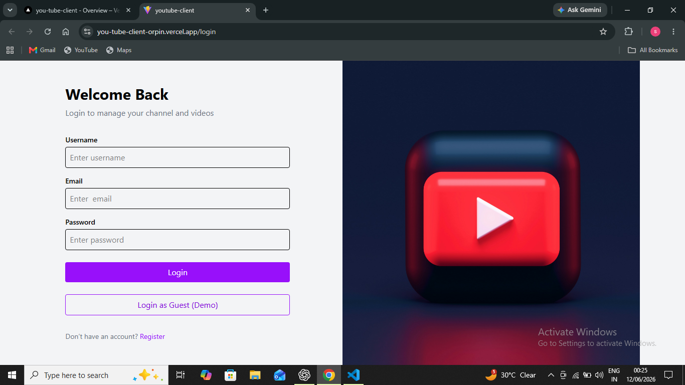
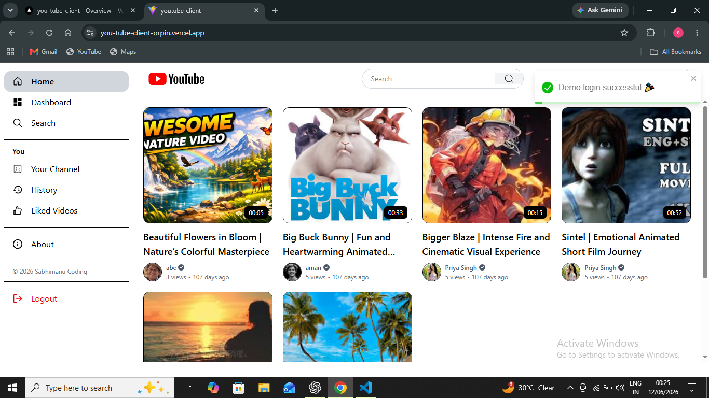
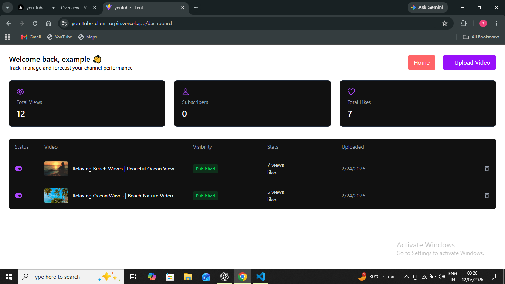
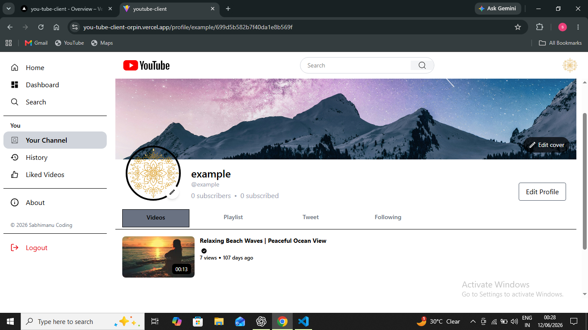
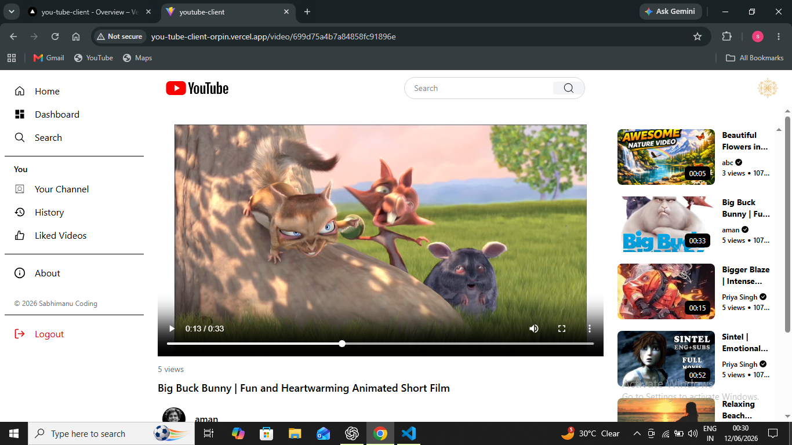

# StreamTube 🎥

A full-stack YouTube-inspired video sharing platform built with the MERN stack. StreamTube allows users to upload videos, create channels, interact with content through likes and comments, manage playlists, subscribe to creators, and track channel performance through a dedicated dashboard.

## 🚀 Live Demo

Frontend: https://you-tube-client-orpin.vercel.app

Backend : https://youtube-backend-qzfq.onrender.com

Github client : https://github.com/sabhi-manu/youTube-client.git

Github backend : https://github.com/sabhi-manu/youTube_backend.git

---

## ✨ Features

### Authentication & Security

* JWT Authentication
* Secure HTTP-only Cookies
* Email OTP Verification
* Refresh Token System
* Protected Routes
* Password Change Functionality
* Zod Validation
* Rate Limiting

### User Management

* User Registration & Login
* Profile Management
* Avatar Upload
* Cover Image Upload
* Channel Profiles
* Watch History

### Video Platform

* Upload Videos
* Upload Custom Thumbnails
* Stream Videos
* Publish/Unpublish Videos
* Edit Video Details
* Delete Videos
* View User Videos

### Engagement Features

* Like Videos
* Comment on Videos
* Edit Comments
* Delete Comments
* View Video Comments

### Playlist System

* Create Playlists
* Update Playlists
* Delete Playlists
* Add Videos to Playlists
* View User Playlists

### Social Features

* Subscribe to Channels
* Creator Profiles
* Tweet Posts
* Like Tweets

### Creator Dashboard

* Total Views Analytics
* Subscriber Count
* Total Likes
* Video Management
* Content Visibility Controls

### Background Processing

* Redis Integration
* BullMQ Job Queues
* Asynchronous Email Processing
* Asynchronous Video Upload Processing

---

## 🛠️ Tech Stack

### Frontend

* React 19
* Redux Toolkit
* React Router
* Axios
* React Hook Form
* Tailwind CSS
* React Player
* React Toastify
* Lucide React

### Backend

* Node.js
* Express.js
* MongoDB
* Mongoose
* JWT Authentication
* Redis
* BullMQ
* Cloudinary
* Nodemailer
* Multer
* Zod

### Deployment

* Frontend: Vercel
* Backend: Render
* Database: MongoDB Atlas
* Cache & Queue: Redis Cloud
* Media Storage: Cloudinary

---

## 📸 Screenshots

### Login Page



### Home Feed



### Creator Dashboard



### Channel Profile



### Video Player



---

## 📂 API Routes

### Authentication

| Method | Endpoint                            |
| ------ | ----------------------------------- |
| POST   | /api/user/register                  |
| POST   | /api/user/login                     |
| POST   | /api/user/logout                    |
| POST   | /api/user/refresh_token             |
| GET    | /api/user/curret_user               |
| GET    | /api/user/channel_profile/:username |
| GET    | /api/user/history                   |

### User Details

| Method | Endpoint                     |
| ------ | ---------------------------- |
| POST   | /api/user/details/password   |
| PATCH  | /api/user/details/profile    |
| PATCH  | /api/user/details/avatar     |
| PATCH  | /api/user/details/coverimage |

### Videos

| Method | Endpoint                           |
| ------ | ---------------------------------- |
| GET    | /api/video                         |
| POST   | /api/video                         |
| GET    | /api/video/:videoId                |
| PATCH  | /api/video/:videoId                |
| DELETE | /api/video/:videoId                |
| PATCH  | /api/video/toggle/publish/:videoId |
| GET    | /api/video/user/:userId            |

### Comments

| Method | Endpoint                |
| ------ | ----------------------- |
| GET    | /api/comment/:videoId   |
| POST   | /api/comment/:videoId   |
| PATCH  | /api/comment/:commentId |
| DELETE | /api/comment/:commentId |


### Playlists

| Method | Endpoint                      |
| ------ | ----------------------------- |
| POST   | /api/playlist                 |
| GET    | /api/playlist/user/:userId    |
| GET    | /api/playlist/:playlistId     |
| PATCH  | /api/playlist/add/:playlistId |
| PATCH  | /api/playlist/:playlistId     |
| DELETE | /api/playlist/:playlistId     |

### Likes

| Method | Endpoint                    |
| ------ | --------------------------- |
| POST   | /api/like/toggle/v/:videoId |
| POST   | /api/like/toggle/t/:tweetId |
| POST   | /api/like/videos            |

### Tweets

| Method | Endpoint            |
| ------ | ------------------- |
| POST   | /api/tweet          |
| GET    | /api/tweet/:userId  |
| PATCH  | /api/tweet/:tweetId |
| DELETE | /api/tweet/:tweetId |

---

## 📁 Project Structure

```text
streamtube
│
├── client
│   ├── src
│   ├── components
│   ├── pages
│   ├── redux
│   └── routes
│
├── server
│   ├── controllers
│   ├── models
│   ├── routes
│   ├── middlewares
│   ├── validations
│   ├── services
│   ├── utils
│   └── config
│
└── README.md
```

## ⚙️ Environment Variables

### Backend

```env
PORT=
MONGODB_URI=

ACCESS_TOKEN_SECRET=
ACCESS_TOKEN_EXPIRY=
REFRESH_TOKEN_SECRET=
REFRESH_TOKEN_EXPIRY=

CLOUDINARY_CLOUD_NAME=
CLOUDINARY_CLOUD_KEY=
CLOUDINARY_CLOUD_API_SECRET=

REDIS_NAME=
REDIS_PASSWORD=
REDIS_HOST=
REDIS_PORT=

EMAIL_USER=
EMAIL_PASS=

```

### Frontend

```env
VITE_API_URL=
```

---

## 🚀 Installation

### Clone Repository

```bash
git clone <repository-url>
cd streamtube
```

### Backend Setup

```bash
cd server

npm install

npm run dev
```

### Frontend Setup

```bash
cd client

npm install

npm run dev
```

---

## 🎯 Future Improvements

* Real-time Notifications
* Live Streaming
* Video Recommendations
* Infinite Scrolling
* Video Analytics Charts
* Community Posts
* AI-Based Video Suggestions
* Multi-language Support

---

## 👨‍💻 Author

Sabhimanu Patel

Full Stack Developer

Built as a production-style MERN application to explore scalable backend architecture, media handling, authentication systems, Redis caching, and asynchronous job processing using BullMQ.

⭐ If you found this project interesting, consider giving it a star.
